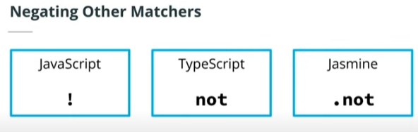

## INDEX

- [INDEX](#index)
- [Testing](#testing)
  - [BDD vs TDD](#bdd-vs-tdd)
    - [Behavior Driven Development (BDD)](#behavior-driven-development-bdd)
    - [Test-Driven Development (TDD)](#test-driven-development-tdd)
  - [Test Design Best Practices](#test-design-best-practices)
- [Jasmine](#jasmine)
  - [Configuring Jasmine](#configuring-jasmine)
  - [Suites and Specs](#suites-and-specs)
  - [Jasmine Syntax](#jasmine-syntax)
    - [Comparisons](#comparisons)
    - [Truthiness](#truthiness)
    - [Numerical Matchers](#numerical-matchers)
    - [Negating](#negating)
    - [Exceptions (error handling)](#exceptions-error-handling)
    - [othermatchers](#othermatchers)
- [Testing Asynchronous Code](#testing-asynchronous-code)
  - [Using async/await](#using-asyncawait)
  - [Using promise](#using-promise)
  - [Testing promise resolution and rejection](#testing-promise-resolution-and-rejection)

---

## Testing

- Introducing testing into your project as a priority and first action allows you to code in a way that writing concise and accurate code that takes into consideration edge cases right from the beginning
- `Unit tests` test individual pieces of code.

---

### BDD vs TDD

#### Behavior Driven Development (BDD)

- tests are focused on how the `user` interacts with the application
- A development style built on `Test Driven Development` where the focus is** user interaction and stakeholders**.
- `Jasmine` is recognized as a Behavior Driven Development testing framework.

#### Test-Driven Development (TDD)

- A development style where tests are written before development
- It focuses on writing unit and integration tests that produce expected results.
- Test Driven Development Cycle

  

---

### Test Design Best Practices

- Test file structure and file names should match the app.
- Describe and name the tests to be easy to read and maintain.
- Write short tests that allow you to pinpoint why the test is failing.
  - write tests with an `object` with data that `should pass` and test each value in the object.
  - Try this again with an object with data that should `fail`
- Tests should only fail when there are bugs in the tested code.

---

## Jasmine

### Configuring Jasmine

- bash

  ```bash
  npm i jasmine

  # Add a reporter for outputting Jasmine results to the terminal
  npm i jasmine-spec-reporter

  # Add type definitions for Jasmine
  npm i --save-dev @types/jasmine
  ```

- json

  ```json
  "scripts": {
    "build" : "npx tsc",
    "jasmine": "jasmine",
    "test": "npm run build && npm run jasmine"
  },
  ```

- File Structure

  ```bash
  ├── node_modules
  ├── spec
  │      └── support
  │           └── jasmine.json
  ├── src
  │     ├──  tests
  │     │     ├── helpers
  │     │     │      └── reporter.ts
  │     │     └── indexSpec.ts
  │     └── index.ts
  ├── package-lock.json
  ├── package.json
  └── tsconfig.json
  ```

- configure the reporter to display Jasmine results to your terminal application -> [reporter.ts](../1-Backend%20Development%20with%20Node.js/Configuring%20Jasmine/reporter.ts)

- configurations for a basic Jasmine configuration -> [jasmine.json](../1-Backend%20Development%20with%20Node.js/Configuring%20Jasmine/jasmine.json)

- In the `tsconfig.json` file, add "`spec`" to the list of folders that we want to exclude as it doesn't has `ts` files it it

  ```json
    "exclude": ["node_modules", "./dist", "spec"]
  ```

- we write the tests in `indexSpec.ts` file

---

### Suites and Specs

- `Spec`: an individual test
- `Suite`: a collection of similar tests related to one function

### Jasmine Syntax

- Use the `describe` keyword followed by a short description of what the suite is testing and one or more specs.
- A best practice is to start a sentence with `“it”` and then complete the sentence with the description of what the suite is testing.

  ```js
  describe("suite description", () => {
    it("describes the spec", () => {
      const myVar = true;
      expect(myVar).toBe(true);
    });
  });
  ```

#### Comparisons

- `.toEqual(expected value)` -> checks if the tested object is the same object
  - it's like `==`
- `toBe()(expected value)` -> checks if the tested object is the same object (same location in memory)
  - it's like `===`

#### Truthiness


#### Numerical Matchers

- `.toBeCloseTo(expected value, precision)`
  - Passes if a value is within a specified `precision` of the expected value
  - `precision` is optional and is represented the number of decimal points to check (defaults to 2)
- .toBeGreaterThan(expected value)
- .toBeLessThan(expected value)
- .toBeGreaterThanOrEqual(expected value)
- .toBeLessThanOrEqual(expected value)

#### Negating



#### Exceptions (error handling)

- `.toThrow(expected value)`
- `.toThrowError(expected value, expected message`

- expected value and expected message are optional

#### othermatchers

- `.toContain(expected value)`
- `.toMatch(expected value)`
- `.toBeDefined()`
- `.toBeUndefined()`
- `.toBeNull()`
- `.toBeNan()`

---

## Testing Asynchronous Code

The key to testing async code is letting Jasmine know `when` it’s ready to be tested.

### Using async/await

- Add async before the asynchronous function call
- Add await before the return
- Testing occurs after the return

```js
it("expects asyncFun () result to equal value", async () => {
  const result = await asyncFun();
  expect(result).toEqual(value);
});
```

### Using promise

- Promise values are included in the return statement
- Test is run in the .then() statement that is chained to the return value

```js
it('expects asyncFunc result to equal value', ()
=> {
   return asyncFunc (). then ( result => {
       expect (result).toEqual (value);
   });
});
```

### Testing promise resolution and rejection

- `.toBeResolved()` tests if a promise is resolved and will return true if the promise is resolved

- `.toBeRejected()` tests if a promise is rejected and will return true if the promise is rejected

- `.toBeRejectedWith(expected value)` tests if the expected error is returned
