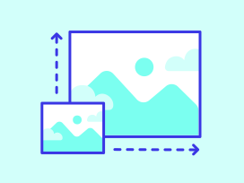
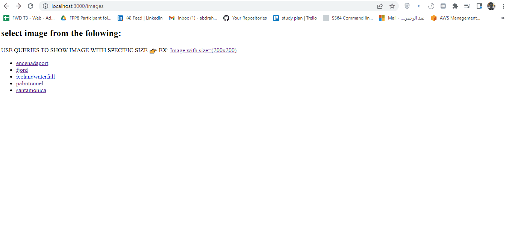
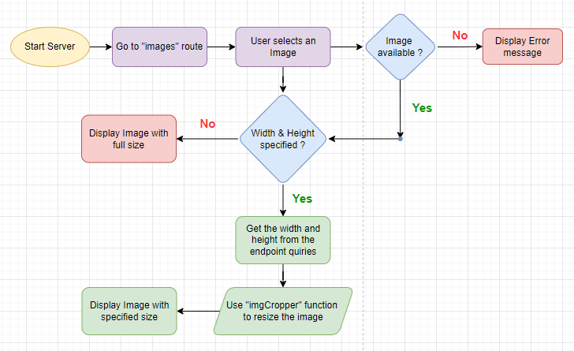

# Image Processing API

<div id="top"></div>


<!-- PROJECT LOGO -->
<br />
<div align="center">
    

  <h3 align="center">Image Processing API</h3>

  <p align="center">
    <a href="https://github.com/abdrahmansoltan/UDACITY-Advanced-Full-Stack-Web-Development/issues">Report Bug</a>
  </p>
</div>

<!-- TABLE OF CONTENTS -->
<details>
  <summary>Table of Contents</summary>
  <ol>
    <li>
      <a href="#about-the-project">About The Project</a>
      <ul>
        <li><a href="#built-with">Built With</a></li>
        <li><a href="#flowchart">Flowchart</a></li>
      </ul>
    </li>
    <li>
      <a href="#getting-started">Getting Started</a>
      <ul>
        <li><a href="#installation">Installation</a></li>
      </ul>
    </li>
    <li><a href="#contributing">Contributing</a></li>
    <li><a href="#acknowledgments">Acknowledgments</a></li>
  </ol>
</details>

<!-- ABOUT THE PROJECT -->

## About The Project



Image Processing API using `node.js` & `Express` to create a server that displays image with the width and height specified by the user

<p align="right">(<a href="#top">back to top</a>)</p>

### Built With

- Node.js
- Epress framework
- sharp
- Jasmine
- prettier
- eslint

### Flowchart



<p align="right">(<a href="#top">back to top</a>)</p>

---

<!-- GETTING STARTED -->

## Getting Started

This project require some prequesites and dependenscies to be installed, you can find the instructions below

> To get a local copy, follow these simple steps :

### Installation

1. Clone the repo
   ```sh
   git clone https://github.com/abdrahmansoltan/UDACITY-Advanced-Full-Stack-Web-Development.git
   ```
2. go to project folder
   ```sh
   cd "Projects\Image Processing API\
   ```
3. install dependenscies
   ```sh
   npm install
   ```
4. install dependenscies
   ```sh
   npm install
   ```
5. Run development server
   ```sh
   npm start
   ```

- or: Run Production server
  ```sh
  node dist/index.js
  ```

6. Testing
   ```sh
   npm run test
   ```
7. Linting
   ```sh
   npm run lint
   ```
8. Formatting code with `prettier`
   ```sh
   npm run prettier
   ```
9. API endpoint

   - Go to this link after running the server ->
     [main-link](http://localhost:3000/images)

<p align="right">(<a href="#top">back to top</a>)</p>

---

<!-- CONTRIBUTING -->

## Contributing

Contributions are what make the open source community such an amazing place to learn, inspire, and create. Any contributions you make are **greatly appreciated**.

If you have a suggestion that would make this better, please fork the repo and create a pull request. You can also simply open an issue with the tag "enhancement".
Don't forget to give the project a star! Thanks again!

1. Fork the Project
2. Create your Feature Branch (`git checkout -b feature/AmazingFeature`)
3. Commit your Changes (`git commit -m 'Add some AmazingFeature'`)
4. Push to the Branch (`git push origin feature/AmazingFeature`)
5. Open a Pull Request

<p align="right">(<a href="#top">back to top</a>)</p>

<!-- ACKNOWLEDGMENTS -->

## Acknowledgments

- [Udacity](https://github.com/udacity)
